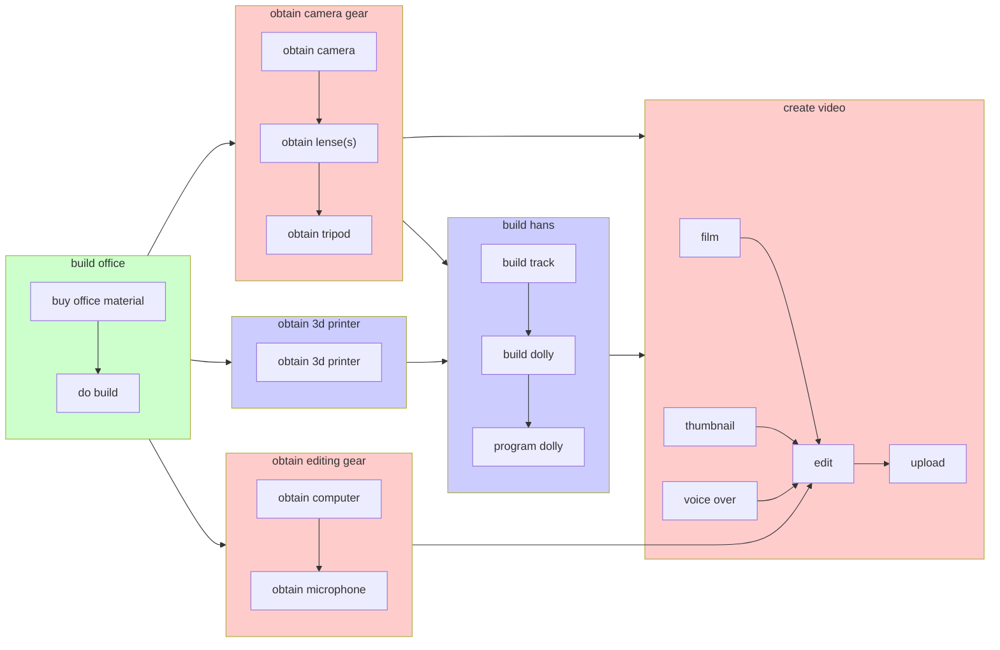

```mermaid
flowchart LR    
    subgraph bo[build office]
    bom[buy office material] --> db[do build]
    end

    subgraph oediting[obtain editing gear]
    ocmp[obtain computer] --> omic[obtain microphone]
    end

    subgraph ocamgear[obtain camera gear]
    ocam[obtain camera] --> olens["obtain lense(s)"] --> otripod["obtain tripod"]
    end

    subgraph oprinter[obtain 3d printer]
    o3dp[obtain 3d printer]
    end

    subgraph bh[build hans]
    btrack[build track] --> bdolly[build dolly]
    bdolly --> pdolly[program dolly]
    end

    subgraph cv[create video]
    film --> edit
    edit --> upload
    thumbnail --> edit
    vo[voice over] --> edit
    end

    bo --> oprinter
    bo --> oediting
    bo --> ocamgear
    ocamgear --> bh
    ocamgear --> cv
    oediting ----> edit
    oprinter --> bh
    bh --> cv

    style bo fill:#00ff0033
    style oprinter fill:#0000ff33
    style bh fill:#0000ff33
    style ocamgear fill:#ff000033
    style oediting fill:#ff000033
    style cv fill:#ff000033
```
