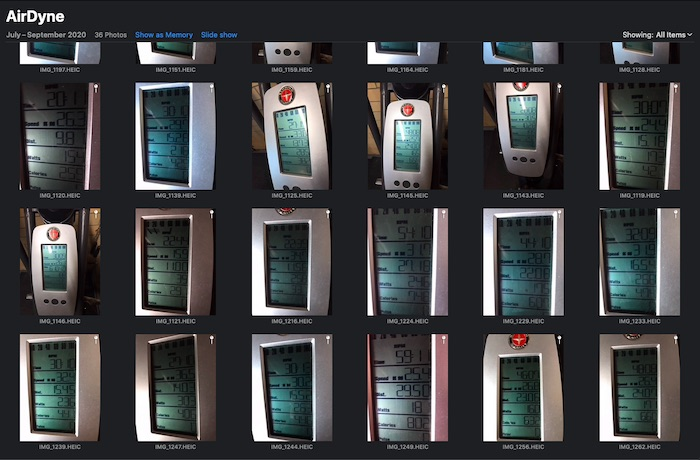
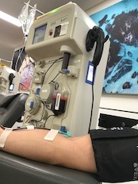
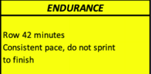
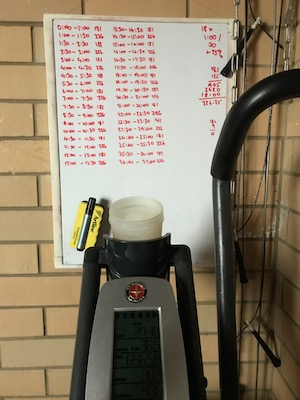

# Year of the Engine Program Review - Year 1

```js
import * as charts from "./charts.js";

// Apply any visual fixes to our charts.
const fixChart = (o) => ({
  backgroundColor: "rgba(0, 0, 0, 0)", // Set background transparent.
  ...o,
});
```

---

Please note this is a review of the **_1st year_**. [Go here for the 2nd
year](/recreation/yoe-year2-review/).

---

## tl;dr

I completed the first year of [The Gains Lab](https://thegainslab.com) [Year of
the Engine](https://thegainslab.com/engine) capacity program by [Matt
Wiebke](https://www.instagram.com/thegainslab1/). The results of each workout
were recorded. Tests were performed during the program and after it was
completed which showed significant improvement in capacity, workout execution
and consistency of effort across a range of workouts. I recommend the program
if you wish to improve your cardiovascular capacity.

### About this review

Whilst going through the Year of the Engine program, I would
occasionally reflect on my results to determine how I was progressing. I
realised I had accumulated a significant amount of data which is
collated into this review. My hope is to give people who are interested
in the program concrete information in the way of results, as well as
subjective information in the way of review and opinion.

<div class="self">
	<p>
    A box like this describes a decision, experience or an observation that I
    made while on the program.
	<p>
</div>

### Disclosure

I have trained with The Gains Lab previously, having completed five months of
the [Total Domination](https://www.thegainslab.com/dominate) program about 9
months prior to starting Year of the Engine. I have also done some
behind-the-scenes work on [The Gains Lab website](https://thegainslab.com)
in exchange for a reduced rate on this program.

This review is unsolicited.

### Approval

Prior to publishing, this review was sent to <a
    href="mailto:coach@thegainslab.com">Matt Wiebke</a> from The Gains Lab seeking:

- Approval to show some specific workouts from the program;
- Comment on accuracy of how I describe the program.

### Workout obfuscation

For purposes of discussion, selected workouts that comprise the program
are described in detail in this review. All other workout descriptions
are obfuscated to protect the content of the program. This obfuscation
is described in more detail <a rel="external" href="#program-workouts">below</a>.

### Data

The results and graphs presented in this review come directly from data
collected throughout the program. Stroke data information for specific rower
and SkiErg workouts were sourced from my account on the [Concept2
Logbook](https://log.concept2.com); links are provided where referenced.

### Program Overview

A broad overview of the program is provided below. More detail is available on
[The Gains Lab Engine](https://thegainslab.com/engine) page. Matt also gives a
good summary [on this /r/crossfit
thread](https://www.reddit.com/r/crossfit/comments/i86gqh/year_of_the_engine_data_from_a_almost_complete/g19kg1f/).

### Phases

```js
const graphPhases = echarts.init(
  display(html`<div style="max-width: 640px; height: 50px;"></div>`),
  "dark"
);
graphPhases.setOption(fixChart(charts.programPhases.phasesOptions()));
```

The program has four phases. Each phase builds on the work from the
previous phase, necessitating completing each one before starting the
next.

| Phase           | Focus                      | Months     | Workout&nbsp;types                              |
| --------------- | -------------------------- | ---------- | ----------------------------------------------- |
| Engine Builder  | Imbalance correction       | 1, 2, 3    | Intervals, Endurance, Time trials               |
| Polarisation    | Improve oxidative capacity | 4, 5, 6    | Intervals, Endurance                            |
| Differentiation | Increase speed and power   | 7, 8, 9    | Intervals, Endurance, Polarisation, Time trials |
| FLUX            | Zero-rest intervals        | 10, 11, 12 | Intervals, Endurance, Polarisation, FLUX        |

### Tracks

The Polarisation and Differentiation phases (months 4 to 9) are split in two
tracks that you can choose from:

- **Pure capacity** ergometer only track. Workouts are apparatus only.
- **Metabolic Conditioning (MetCon)** track. Workouts utilise
  multi-movement patterns with varying equipment (eg. barbells, dumbbells,
  wallballs, jump rope, etc)

```js
const tracksOptions = echarts.init(
  display(html`<div style="max-width: 640px; height: 75px;"></div>`),
  "dark"
);
tracksOptions.setOption(fixChart(charts.programPhases.tracksOptions()));
```

It is possible to mix and match between tracks, and change tracks
between phases.

### Workouts

Workouts were received via email each month as a single .pdf file. Each
file contains four weeks of workouts, each week having five workouts to
complete.

An exception to this format is the first month of the program, in
which the fifth workout in each week is optional.

### Workout types

```js
const workoutTypes = echarts.init(
  display(html`<div style="max-width: 640px; height: 200px;"></div>`),
  "dark"
);
workoutTypes.setOption(fixChart(charts.workoutTypes.workoutTypes()));
```

Each workout type is described below. As <a rel="external"
href="#about-this-review-workout-obfuscation">mentioned above</a>, only a
select number of workouts are described in full in this document; all other
workout descriptions are obfuscated according to the rules below.

<table>
    <tr>
        <th>Workout Type</th>
        <th>Description</th>
        <th>Example workout</th>
        <th>Obfuscation</th>
        <th>Described here as</th>
    </tr>
    <tr>
        <th>Interval</th>
        <td>Alternating rounds of work time or distance, and rest time.
        Broken up into speed/threshold, anaerobic and max aerobic power
        sub-types.</td>
        <td>4x500m/1:00r</td>
        <td>Cumulative work time and rest time.</td>
        <td class="right"><strong>2k/3:00r</strong></td>
    </tr>
    <tr>
        <th>Endurance</th>
        <td>Total duration of work time at consistent pace.</td>
        <td>52:00 consistent pace</td>
        <td>No change.</td>
        <td
            class="right"><strong>52:00</strong></td>
    </tr>
    <tr>
        <th>MetCon</th>
        <td>Exercises to be done for time, or for rounds and
            repetitions.</td>
        <td>For time<br />
            <ul>
                <li>20 burpees</li>
                <li>Run 400m (or row 500m)</li>
            </ul>
            Repeat until you have completed 100
            burpees and run 1 mile (or rowed 2k)</td>
        <td>Not used in this review.</td>
        <td>Not used in this review.</td>
    </tr>
    <tr>
        <th>Time trials</th>
        <td>Total duration of work time at or beyond a competition
            pace.</td>
        <td>10:00.0 Time Trial</td>
        <td>No change.</td>
        <td class="right"><strong>10:00.0</strong></td>
    </tr>
    <tr>
        <th>Polarisation</th>
        <td>Total duration of work time, with repeated intervals of
            maximum effort for short durations.</td>
        <td>24:00 at endurance pace with max effort for 0:07 at minutes 5,
            10, 15 and 20</td>
        <td>Total work time.</td>
        <td
            class="right"><strong>24:00</strong></td>
    </tr>
    <tr>
        <th>FLUX</th>
        <td>Alternating rounds of work at endurance pace and above
            endurance pace.</td>
        <td>12 rounds of:
            <ul>
                <li>2 minutes endurance pace</li>
                <li>1 minute at 120% endurance pace</li>
            </ul>
        </td>
        <td>Total work time.</td>
        <td
            class="right"><strong>36:00</strong></td>
    </tr>
</table>

[Sample workouts](https://www.thegainslab.com/engine)
[FAQ](https://www.thegainslab.com/yefaq)

### Equipment

Year of the Engine uses ergometers. The program as supplied gives options for:

- Rowing on the Concept2 indoor rowing machine or similar;
- Skiing on the Concept2 SkiErg or similar;
- Biking on the Assault Air Bike, Rogue Echo Bike, Concept2 BikeErg, Schwinn
  AirDyne or similar; and
- Running.

Each workout can be completed with a different apparatus. Scalings are
supplied. The program strongly suggests which apparatus are <i>not</i>
suitable for certain workouts.

### Additional Training

The program can be run as standalone or in addition to other training.
Integration with other training is left to the athlete to manage.

## Methodology

### The subject

- Male, late 40s, 182cm, 100kg.
- Married, kids, desk-bound work. Normal day-to-day western-lifestyle stresses.
- Basketball, mountain biking, road cycling, snowboarding, martial arts prior
  to 2012. CrossFit and running about after the kids since 2012.
- Non-competitive exerciser. Training to stay healthy.
- About an hour available to train each day.
- Meat-and-three-veg diet. Dad-bod well in progress. Probably too many
  [Tim Tam](https://en.wikipedia.org/wiki/Tim_Tam)s.
- Plasma donor, every two weeks (<a rel="external"
  href="#subjective-observations-donating-plasma">interesting observation</a>).

### Tracks

As <a rel="external" href="#program-workouts">previously noted</a>, there are
two tracks you can choose from during phases 2 and 3: pure capacity or
metabolic conditioning.

<div class="self">
	<p>
    I chose <strong>pure capacity</strong>. All references to workouts in
    this review will only be for this track, and not for the MetCon track.
	<p>
</div>

### Scheduling

The program places no restriction on what days workouts are to occur,
only that each weeks' workouts are to be completed before moving to the
next week.

The program deliberately allows you to move workouts around during the
week in order to fit in with other training and life.

<div class="self">
    <p>
    I tried to do shorter workouts (intervals, time trials) during the
    week, and longer workouts (endurance, polarisation, flux) on the
    weekend to fit in with life.
    </p>
    <p>
    I chose not to explicitly schedule rest days, taking a day off when
    tired or if life conflicted with training.
    </p>
    <p>
    Some workouts were shifted between weeks due to life.
    </p>
    <p>
    My workouts were predominantly done between 05:00 and 09:00, and
    prior to first meal of the day.
    </p>
</div>

### Additional Training

<div class="self">
    <p>
    During phases 2 and 3, I was able to fit in strength training of
    less than 45 minutes, between two and three times per week.
    Exercises rotated between various combinations of back squat, press,
    deadlift, front squat, bench press and pull-ups.  Maintenance
    weights only; loads did not increase. These workouts were done
    immediately before the scheduled Year of the Engine workout for that
    day.
    </p>
    <p>
    I completed perhaps a half-dozen MetCon workouts while doing the
    program, as part of social events and not as part of training. I did
    not do a Year of the Engine workout on these days due to lack of
    time.
    </p>
    <p>
    All other exercise was incidental. This included road and mountain
    bike riding, an occasional swimming session, and  playing with my
    kids.
    </p>
</div>

### Equipment

I chose:

<table>
    <tr>
        <th>Workout&nbsp;type</th>
        <th>Apparatus</th>
        <th>Rationale</th>
    </tr>
    <tr>
        <td>Interval</td>
        <th>Rower SkiErg</th>
        <td>Concept2 provide the mobile application <a
        href="https://concept2.com/ergdata">ErgData</a> which records entire
        workouts performed on their ergometers. This includes per-stroke data,
        which came in useful for examining interval consistency.</td>
    </tr>
    <tr>
        <td>Time trials</td>
        <th>Rower AirDyne</th>
        <td>Time trials in the program are specified for the rower
            and air bike.</td>
    </tr>
    <tr>
        <td>Endurance<br />
            Polarisation<br />
            FLUX<br />
        </td>
        <th>AirDyne</th>
        <td>I find longer sessions more comfortable and tolerable on
            the bike than on rower or SkiErg.</td>
    </tr>
</table>

| Schwinn AirDyne6                            | Concept2 SkiErg                            | Concept2 Rower                            |
| ------------------------------------------- | ------------------------------------------ | ----------------------------------------- |
|  |  |  |

### Recording results

The .pdf supplied each month specifies what to record for each workout,
with space available to write results. Matt suggests printing out each
sheet and recording directly on the sheet.

<div class="self">
    <p>
    On the rower and SkiErg I used Concept2's <a
    href="https://concept2.com/ergdata">ErgData</a> to record each session,
    which were then uploaded to the <a href="https://log.concept2.com">Concept2
    Logbook</a>. Workout information,
    including stroke data, was extracted using the <a
    href="https://log.concept2.com/developers/documentation/">Concept2
    developer API</a>).
    </p>
    <p>
    The AirDyne lacks automated recording, so I took a photo of the
    monitor at the end of each workout and tabled the results in a
    spreadsheet.
    </p>
</div>



A sample of the air bike post-workout gallery.

### Execution

I started the program on Monday 16th September 2019, and finished on
Sunday 13th September, 2020.

Workouts, and their phases, were completed as below.

```js
const summary = echarts.init(
  display(html`<div style="max-width: 640px; height: 170px;"></div>`),
  "dark"
);
summary.setOption(fixChart(charts.execution.summary()));
```

## Objective results

The following workouts are presented as evidence of performance changes
both during and after year one of the Year of the Engine program. The
results are mine alone (<i>n</i> = 1).

The workouts have been chosen as they are either <i>de-facto</i> tests
of fitness, have notoriety within the fitness community, or the process
of doing the workout and investigating the data yielded interesting
results.

### 10:00.0 Air Bike time trial

The 10:00.0 air bike test is scheduled three times in phase 1 (weeks 4, 8, 12)
and three times in phase 3 (weeks 25, 29, 33). These tests are not placed
ouside of the workout schedule; they are included as part of training. No
special preparation was taken for these tests.

```js
const ttAirDyne = echarts.init(
  display(html`<div style="max-width: 640px; height: 200px;"></div>`),
  "dark"
);
ttAirDyne.setOption(fixChart(charts.timeTrial.ttAirDyne()));
```

There was 11.2% increase in calories recorded by the AirDyne monitor
between the first and last test.

<div class="self">
    <p>
    There's not much in the way of exposition for this test. The goal
    each time was to increase number of calories from the previous test,
    and to be as consistent as possible throughout the test.
    </p>
    <p>
    The AirDyne doesn't have any way of recording intra-workout metrics;
    it would have been nice to see where pace changes occurred in order
    to develop a better approach than &ldquo;go fast and hang on&rdquo;.
    </p>
    <p>
    Couldn't quite get to 200cals in the last test.
    </p>
</div>

### 20:00.0 rower time trial

The 20:00.0 rower test is scheduled three times in phase 3 (weeks 27,
31, 35). These tests are not placed outside of the workout schedule;
they are included as part of training. No special preparation was taken
for these tests.

```js
const ttRower = echarts.init(
  display(html`<div style="max-width: 640px; height: 200px;"></div>`),
  "dark"
);
ttRower.setOption(fixChart(charts.timeTrial.ttRower()));
```

Logbook data:
[Attempt 1](https://log.concept2.com/profile/1063564/log/43117686)
[Attempt 2](https://log.concept2.com/profile/1063564/log/44040753)
[Attempt 3](https://log.concept2.com/profile/1063564/log/44857244)

There was 2.8% increase in calories recorded by the rower monitor
between the first and last test. Pace increased by 1.4s/500m between
tests 1 and 2, but only 0.1s/500m between tests 2 and 3.

<div class="self">
	<p>
    Test 3 felt very poor. I was unwell at the end of the previous week and
    was most likely still recovering. While faster than test 1, it was
    equal to test 2. I bonked with less than 4 minutes to go, whereas pace
    was held throughout tests 1 and 2. We can see this by examining the pace
    for each test:
	<p>
</div>

```js
const tt20 = echarts.init(
  display(html`<div style="max-width: 640px; height: 200px;"></div>`),
  "dark"
);
tt20.setOption(fixChart(charts.strokedata.tt20()));
```

Attempts at the 20:00.0 rower time trial prior to the Year of the Engine
are shown below, along with the three tests from above. Year of the
Engine programming period is shaded.

```js
const ttRower2000FullHistory = echarts.init(
  display(html`<div style="max-width: 640px; height: 200px;"></div>`),
  "dark"
);
ttRower2000FullHistory.setOption(
  fixChart(charts.timeTrial.ttRower2000FullHistory())
);
```

### 24x0:30/0:30r rower

24x0:30/0:30r (24 intervals of 30 seconds work, 30 seconds rest) is
scheduled once each in phases 1, 3 and 4 (weeks 11, 27, 45). I
completed the 1st and 3rd workout on the rower, and the second on the
SkiErg. Here we will examine the rower workouts.

```js
const repeated243030 = echarts.init(
  display(html`<div style="max-width: 640px; height: 200px;"></div>`),
  "dark"
);
repeated243030.setOption(fixChart(charts.timeTrial.repeated243030()));
```

A cursory glance indicates a worse result at attempt 2. A closer
examination is required.

<table class="data">
    <tr>
        <th>24x0:30/0:30r</th>
        <th>Attempt 1</th>
        <th>Attempt 2</th>
        <th>Variance</th>
    </tr>
    <tr>
        <th>Date</th>
        <td>24th November, 2019</td>
        <td>21st August, 2020</td>
        <td>+8 months, 28 days</td>
    </tr>
    <tr>
        <th>Average Pace (/500m)</th>
        <td>1:39.3</td>
        <td>1:39.1</td>
        <td>-0:00.2</td>
    </tr>
    <tr>
        <th>Distance</th>
        <td>3,624m</td>
        <td>3,631m</td>
        <td>+7m</td>
    </tr>
    <tr>
        <th>Calories</th>
        <td>296 calories</td>
        <td>294 calories</td>
        <td>-2 calories</td>
    </tr>
    <tr>
        <th>Stroke count</th>
        <td>364 strokes</td>
        <td>348 strokes</td>
        <td>-16 strokes</td>
    </tr>
    <tr>
        <th>Stroke rate</th>
        <td>29 spm</td>
        <td>28 spm</td>
        <td>-1 spm</td>
    </tr>
    <tr class="self">
        <th>RPE</th>
        <td>8-9</td>
        <td>7-8</td>
        <td>-1 point</td>
    </tr>
    <tr>
        <th>Concept2 logbook</th>
        <td><a href="https://log.concept2.com/profile/1063564/log/40524237">Attempt 1</a></td>
        <td><a href="https://log.concept2.com/profile/1063564/log/46414252">Attempt 2</a></td>
        <td>N/A</td>
    </tr>
</table>

Distance and pace barely improved. Calories were lower in attempt 2,
again marginally. Stroke rate per interval was lower, resulting in fewer
total strokes across the workout. There were 9 months between attempts.

- Was attempt 2 an improvement over attempt 1?
- If so, why wasn't it bigger, since 9 months of training had elapsed?

Let's start with stroke count, as it sticks out the most. Attempt 2
recorded 16 fewer strokes. We can see where this happened by looking at
the number of strokes per interval:

```js
const repeated243030_spi = echarts.init(
  display(html`<div style="max-width: 640px; height: 200px;"></div>`),
  "dark"
);
repeated243030_spi.setOption(
  fixChart(charts.repeated.interval_24_30_30.strokesPerInterval())
);
```

Attempt 2 had one less stroke in 16 of the 24 intervals
compared to the attempt 1. We know the attempt 2 covered further
distance, so we can make the presumption that <u>distance per stroke
increased</u>.

What is the impact of one fewer stroke per interval over the same
distance? We can examine distance each interval, and graph by stroke:

```js
const repeated243030_dpi_all = echarts.init(
  display(html`<div style="max-width: 640px; height: 200px;"></div>`),
  "dark"
);
repeated243030_dpi_all.setOption(
  fixChart(charts.repeated.interval_24_30_30.distancePerIntervalAllStrokes())
);
```

As attempt 2 drops strokes compared to attempt 1, it's graph
&ldquo;shifts left&rdquo;, until it is 16 strokes ahead of attempt 1.
Attempt 2 has completed the same distance as attempt 1, but with fewer
strokes. And the 16 strokes difference matches our variance previously
tabled.

So how far apart, in distance, are the attempts each interval? Using
attempt 1 as a baseline, we can graph attempt 2's increase or decrease
in distance per interval:

```js
const repeated243030_dpi_delta = echarts.init(
  display(html`<div style="max-width: 640px; height: 200px;"></div>`),
  "dark"
);
repeated243030_dpi_delta.setOption(
  fixChart(charts.repeated.interval_24_30_30.distanceDeltaPerInterval())
);
```

We can see that compared to attempt 1, attempt 2 started out with a
large lead in interval 1, continued building through to interval 15,
then recorded reduced distance in intervals 17 to 24. We can visualise
the &ldquo;lead&rdquo; by accumulating this difference each interval:

```js
const repeated243030_dpi_banked = echarts.init(
  display(html`<div style="max-width: 640px; height: 200px;"></div>`),
  "dark"
);
repeated243030_dpi_banked.setOption(
  fixChart(charts.repeated.interval_24_30_30.bankedDistanceByInterval())
);
```

By interval 15, attempt 2 has accumulated a lead of 29m over attempt 1.
This gain is eroded as the workout continues. The distance remaining in
attempt 2's bank at the end of the last interval is 7m, which matches
our variance previously tabled.

However, we have yet to determine <i>why</i> the distance discrepancy
appears. Was attempt 1 slow opening then sped up? Did attempt 2 do the
opposite? Let's look at pace in each interval.

```js
const repeated243030_ppi = echarts.init(
  display(html`<div style="max-width: 640px; height: 200px;"></div>`),
  "dark"
);
repeated243030_ppi.setOption(
  fixChart(charts.repeated.interval_24_30_30.pacePerInterval())
);
```

The points representing pace for attempt 1 appear to vary more than
attempt 2. We can look at the distribution of pace for both attempts to
verify:

```js
const repeated243030_ndp = echarts.init(
  display(html`<div style="max-width: 640px; height: 200px;"></div>`),
  "dark"
);
repeated243030_ndp.setOption(
  fixChart(charts.repeated.interval_24_30_30.normalDistributionPace())
);
```

By grouping the intervals' pace from each attempt, we can see that the range of
attempt 2 is tighter than attempt 1, demonstrating the principle of
[maximising the average, minimising the range](https://www.thegainslab.com/interval-training):

```js
const repeated243030_rp = echarts.init(
  display(html`<div style="max-width: 640px; height: 200px;"></div>`),
  "dark"
);
repeated243030_rp.setOption(
  fixChart(charts.repeated.interval_24_30_30.rangePace())
);
```

Attempt 2 held a <u>more consistent pace</u> per interval than attempt 1.

One last thing to look at is power per stroke:

```js
const repeated243030_wps = echarts.init(
  display(html`<div style="max-width: 640px; height: 200px;"></div>`),
  "dark"
);
repeated243030_wps.setOption(
  fixChart(charts.repeated.interval_24_30_30.wattsPerStroke())
);
```

The distribution balances out the spikes:

```js
const repeated243030_ndw = echarts.init(
  display(html`<div style="max-width: 640px; height: 200px;"></div>`),
  "dark"
);
repeated243030_ndw.setOption(
  fixChart(charts.repeated.interval_24_30_30.normalDistributionWatts())
);
```

Attempt 2 generated marginally <u>more power per stroke</u> than attempt
1, with a slightly improved consistency.

Summing up: objectively we have:

- Attempt 2 used fewer strokes to go further.
- Attempt 2 had a lower calorie cost.
- Attempt 2 showed more consistency in pace.
- Attempt 2 showed more power per stroke.

Subjectively, we have:

- Attempt 2 RPE improved.

We can summarise the above points by saying attempt 2 was more **efficiently
executed** than attempt 1. Attempt 2 yielded a marginally better result than
attempt 1 at a lower energy cost, and demonstrated **improved consistency of
effort**.

But this conclusion does nothing to explain the lack of <u>significant
improvement</u> given the 9 months of training between attempts. Why?

<div class="self">
    <p>
    Occam's razor: I screwed up.
    </p>
    <p>
    When repeating workouts, I check my previous result, consider how
    I'm feeling, predict how much faster I could complete the work and
    use that as my goal. When I checked my history, I accidently looked
    up <strong>2<u>0</u>x0:30/0:30r</strong> instead of 2<u>4</u>x0:30/0:30r).
    </p>
    <p>
    20x0:30/0:30r had a pace of 1:40.5. It was done 6 weeks prior to
    attempt 1 of 24x0:30/0:30r.
    </p>
    <p>
    For attempt 2, I conservatively chose 1:39.5, not realising I
    should have been aiming for at least 1:38.3.
    </p>
    <p>
    In the end: attempt 2 had a pace of 1:39.1, an improvement on
    20x0:30/0:30r, an improvement on 24x0:30/0:30r, faster than the goal
    pace set at the start of the workout, and completed with a lowered
    RPE.
    </p>
</div>

While the on-paper gain was negligible, we could conclude that there was
improvement between attempts, but instead of bigger / faster / stronger,
the gain was a **demonstrated increase in ability to hold a
consistent pace**.

<div class="self">
	<p>
    And a lesson: when repeating workouts, check previous results twice.
	<p>
</div>

### 3x2,000m/3:00r rower

3x2,000m/3:00r rower (3 intervals of 2,000m with 3:00 rest in between)
is scheduled once in phase 1 (week 12). Attempt 2 was done after the end
of the program. Year of the Engine programming period is shaded.

```js
const repeated32000300 = echarts.init(
  display(html`<div style="max-width: 640px; height: 200px;"></div>`),
  "dark"
);
repeated32000300.setOption(fixChart(charts.timeTrial.repeated32000300()));
```

<table class="data">
    <tr>
        <th>3x2,000m/3:00r</th>
        <th>Attempt 1</th>
        <th>Attempt 2</th>
        <th>Variance</th>
    </tr>
    <tr>
        <th>Date</th>
        <td>7th December, 2019</td>
        <td>15th September, 2020</td>
        <td>+9 months, 8 days</td>
    </tr>
    <tr>
        <th>Average Pace (/500m)</th>
        <td>1:53.5</td>
        <td>1:51.7</td>
        <td>-0:01.8</td>
    </tr>
    <tr>
        <th>Time</th>
        <td>22:42.6</td>
        <td>22:20.6</td>
        <td>-0:22.0</td>
    </tr>
    <tr>
        <th>Calories</th>
        <td>423 calories</td>
        <td>433 calories</td>
        <td>+10 calories</td>
    </tr>
    <tr>
        <th>Stroke count</th>
        <td>588 strokes</td>
        <td>542 strokes</td>
        <td>-46 strokes</td>
    </tr>
    <tr>
        <th>Stroke rate</th>
        <td>26 spm</td>
        <td>24 spm</td>
        <td>-2 spm</td>
    </tr>
    <tr class="self">
        <th>RPE</th>
        <td>8-9</td>
        <td>7-9</td>
        <td>-1</td>
    </tr>
    <tr>
        <th>Concept2 logbook</th>
        <td><a
                target="_blank"
                href="https://log.concept2.com/profile/1063564/log/40793098">Attempt
                1 data</a></td>
        <td><a
                target="_blank"
                href="https://log.concept2.com/profile/1063564/log/46905512">Attempt
                2 data</a></td>
        <td>N/A</td>
    </tr>
</table>

Let's compare interval pace. The fastest interval in attempt 1 was
slower than the slowest interval in attempt 2; the fastest interval in
attempt 2 beat the fastest in attempt 1 by 11 seconds:

```js
const repeated32000300_rp = echarts.init(
  display(html`<div style="max-width: 640px; height: 200px;"></div>`),
  "dark"
);
repeated32000300_rp.setOption(
  fixChart(charts.repeated.interval_3_2000_300.rangePace())
);
```

Comparing each interval by pace shows more consistency and a bigger
finish in attempt 2:

```js
const repeated32000300_is = echarts.init(
  display(html`<div style="max-width: 640px; height: 200px;"></div>`),
  "dark"
);
repeated32000300_is.setOption(
  fixChart(charts.repeated.interval_3_2000_300.intervalStrokedata())
);
```

This is backed up by examining the normal distribution of pace for each
interval. The lack of consistency in the third interval of attempt 2 is
because of the sprint finish, much faster than attempt 1 but with a
larger range:

```js
const repeated32000300_ind = echarts.init(
  display(html`<div style="max-width: 640px; height: 200px;"></div>`),
  "dark"
);
repeated32000300_ind.setOption(
  fixChart(charts.repeated.interval_3_2000_300.intervalNormalDistribution())
);
```

The stroke rate of attempt 2 was lower than attempt 1 across all
intervals (excluding the sprint finish). This is reflected in our tabled
data of 46 fewer strokes over the whole workout, and 2 fewer strokes per
minute:

```js
const repeated32000300_spm = echarts.init(
  display(html`<div style="max-width: 640px; height: 200px;"></div>`),
  "dark"
);
repeated32000300_spm.setOption(
  fixChart(charts.repeated.interval_3_2000_300.intervalStrokedataSPM())
);
```

<div class="self">
    <p>
    Attempt 2 felt no more difficult than attempt 1, but the result was a
    big increase in pace and consistency. I feel that this result is much
    more important than the time trials, as it demonstrates a skill increase
    in managing pace, stroke rate, power delivery and recovery, and not just
    pure grunt increase.
    </p>
    <p>
    It would be interesting to try this test again with a higher stroke
    rate in the last interval.
    </p>
</div>

### Acid Bath

&ldquo;Acid Bath&rdquo; was the 6th individual workout programmed for the <a
target="_blank" href="https://dubaicrossfitchampionship.com/schedule.html">2018
Dubai CrossFit Championship</a>. It is one variant of the <a target="_blank"
href="https://www.concept2.com/news/introducing-ergathlon">Concept2 Ergathlon
Super Sprint</a>:

<blockquote>
For time:

- 500m Concept2 SkiErg
- 500m Concept2 rower
- 1000m Concept2 BikeErg

7:00 time cap (women)  
6:00 time cap (men)

</blockquote>

The workout took me 5:18. Compared to some others:

```js
const acidBath = echarts.init(
  display(html`<div style="max-width: 640px; height: 200px;"></div>`),
  "dark"
);
acidBath.setOption(fixChart(charts.acidBath.timeline()));
```

Roman Khrennikov and Mat Fraser's approximate times taken from the clock on the
[event video](https://youtu.be/RwPwuMUZYHE?t=22702). Marston Sawyers and Heber
Canon's times taken from The Buttery Bros [Acid Bath in Mat Fraser's Garage
video](https://www.youtube.com/watch?v=HiWr-fXLe7Q), with some extrapolation
due to not having a continually visible running clock.

<div class="self">
    <p>
    This workout isn't part of the program, but I thought it would be fun
    to do an ergometer-based test that has been used in competition and
    on (community) social media to compare times.
    </p>
    <p>
    I used an AirDyne6 instead of a BikeErg. So while the graph above is
    as accurate as possible for times, the bikes will not accumulate
    metres in the same fashion so my placing is optimisitic. Again, just
    for fun.
    </p>
    <p>
    <a target="_blank"
        href="https://youtu.be/Breuh1r1GRA">Video of my attempt</a>,
    <a target="_blank"
        href="https://log.concept2.com/profile/1302786/log/46858127">SkiErg stroke data</a>
    and <a target="_blank"
        href="https://log.concept2.com/profile/1063564/log/46858060">rower
        stroke data</a>.
    </p>
</div>

## Subjective observations

### Workout approach

My approach to workouts has changed. The higher-than-comfortable
sustained "steady state" work from the program has changed my perception
of the usefulness of fly-and-die. I now temper opening rounds in a
workout aiming for 100% consistency instead of going too hard early
and trying to recover on the run.

### The phenomenom of fast finishes

While completing phase 1, I started to notice that many of my interval results
were following a similar pattern: the last interval was usually at a higher
pace than the previous intervals, with a kick toward the end, like below:

```js
const fastfinishes = echarts.init(
  display(html`<div style="max-width: 640px; height: 200px;"></div>`),
  "dark"
);
fastfinishes.setOption(fixChart(charts.intervalGraph.workout_40553854()));
```

Sometimes I couldn't hold the kick all the way to the end of the
interval, but inexplicibly, my pace stayed above the average for
that interval, like below:

```js
const fastfinishes_2 = echarts.init(
  display(html`<div style="max-width: 640px; height: 200px;"></div>`),
  "dark"
);
fastfinishes_2.setOption(fixChart(charts.intervalGraph.workout_41335805()));
```

It's not negative splits, I didn't feel that I sandbagged these
workouts, and I had chosen paces that I knew I could hold across all
intervals without going too fast nor slow.

Other athletes doing Year of the Engine have shown this as well; some examples
<a target="_blank" href="https://www.instagram.com/p/CCJSP72A7V0/">here</a>,
<a target="_blank" href="https://www.instagram.com/p/CBlQxrLAv80/">here</a>,
<a target="_blank" href="https://www.instagram.com/p/CBVzBuTg73c/">here</a> and
<a target="_blank" href="https://www.instagram.com/p/CAvHCsNArfU/">here</a>.

<div class="self">
	<p>
    This is probably due to being too conservative in opening intervals. I
    guess with more experience it would be possible to choose opening paces
    better, and close the gap between them and the last interval.
	<p>
</div>

### RPE

The <a target="_blank"
href="https://en.wikipedia.org/wiki/Rating_of_perceived_exertion">rating of
perceived exertion scale</a> (RPE) is a measure of <i>perceived</i> exertion of
a physical activity. The biggest change I feel related to RPE is being able to
hold consistent pace on the air bike. A year ago, holding 29-30kph on the
AirDyne for 20:00 was my limit, and rated it RPE 10. I am now able to hold the
same pace for 60:00 at RPE 7.

### Technique changes

My &ldquo;skill&rdquo; level on the air bike has significantly improved.
The cycling motion is now more refined with significantly less lateral
movement. In particular, bobbing of the head left and right has
vanished, with torso remaining much more still and upright. These
improvements feel like I'm putting more energy into the bike rather
than away from it.

The SkiErg remains a mystery.

<a name="subjective-observations-donating-plasma"></a>

### Donating plasma



Part of a post I made on <a target="_blank"
href="https://www.reddit.com/r/crossfit/comments/fqf4h9/blood_donations_exercise_and_recovery_periods/">/r/crossfit</a>
in early 2020:

> Up until end of last year, I would donate plasma on a Saturday
> morning after a workout, then rest until late Sunday afternoon to do
> my next workout - averaging between 30 and 33 hours of rest.
>
> Schedule change at start of the year meant donating on Sunday
> morning, resting until Monday morning workout - averaging between 23
> to 25 hours of rest. So a decrease of around 7 hours.
>
> Since the schedule change, I've noticed significant drop offs in
> performance in that first workout after donating. The sensation
> during the workout isn't of a fatigue brick, huge drop in energy or
> I-think-I'm-dying; it's more of a "I can't sustain this pace even
> though I should be able to," and so I slow to make it through
> without stopping. Subsequent workouts, spaced at 24-hour periods,
> are fine.
>
> All other things being equal, the altered rest period
> seems to affect me significantly, with age no doubt playing a part
> too. Some random Googling turned up <a target="_blank"
> href="https://blog.nasm.org/fitness/donating-blood-and-exercise-what-athletes-should-know">this
> document from NASM</a> regarding effects of blood, plasma and platelet
> donations on exercise. There are some papers listed in the reference
> section which were very interesting support material.

## Reflection

### What I believe I got right

- **Followed the program**. Adherence to the program was initially difficult,
  but once a proper schedule was established, and an understanding of the
  amount of effort required to complete the first couple of months was
  achieved, it became much easier to follow the program.
- **Moved workouts around inside the training week**. In order to fit the
  workouts into my schedule, it was necessary to move them within the week
  rather than strictly follow the program. This is provided for in the program.
  Had I tried to do the workouts in order as written, it would have been nearly
  impossible to fit into my schedule.
- **Rested by feel, not by schedule**. I explicitly chose not schedule rest
  days into my week, instead opting to rest when tired or when non-training
  events prevented training. This worked well; some weeks I would do 6 days in
  a row, starting the next weeks' training early. Other weeks life would get in
  the way and I might miss a few days in a row. I feel if I had tried to stick
  hard to a schedule, I would have missed a lot more training days.

### What I know got wrong

- **Insufficient attention to recovery**. During phase 2, I started getting a
  lot of lower back, glute and hip flexor pain. This was probably caused by an
  increase of time on the AirDyne during this phase. I was not used to sitting
  on a stationary bike for extended periods and had poor form. The rower was
  the primary apparatus on the previous phase and did not contribute to any
  symptoms. I added a stretching plan into my schedule and gradually the pain
  subsided.
- **Overly optimistic endurance pace selection**. Phase 2 requires selection
  of an <i>endurance&nbsp; pace</i>, which is held as a minimum pace during
  Endurance, Polarisation and FLUX workouts. It is described by Matt as:
    <blockquote>
        Your friend enters the gym and walks over to say hello.  You
        have sufficient oxygen such that you can say a quick hello, ask
        him politely how it's going, but cannot carry on a conversation
        of any length.
    </blockquote>
        and:
    <blockquote>
        Pace for endurance days: 7/10 rpe, 70-75% max HR, so as long as
        you’re around there, it’s good work.
    </blockquote>
    My initial endurance pace estimate was too fast, and as workouts became
    longer, it was more difficult to hold onto pace. I took too many workouts
    to realise this was the problem. However once the penny dropped, I used the
    next couple of Polarisation workouts to narrow down the pace to better
    match Matt's description.

### What I think I would change

- **Spread workouts across more apparatus**. Throughout phases 3 and 4 I
  worked mainly on the AirDyne, only doing intervals on the rower and rarely
  the SkiErg. While the main reasons for this was comfort on longer sessions, I
  suspect balancing out work across apparatus would be a more beneficial
  approach, giving more resilience to longer workouts on the rower and SkiErg.

- **Include some workouts from the MetCon track**. I chose to follow just the
  ergometer track, foregoing any weightlifting and gymnastics movements. No
  doubt this contributed to the feeling of <i>grind</i>. Interspersing
  non-ergometer workouts throught the program would introduce more variance and
  reduce that grindy feeling.

- **Upgrade the air bike**. I used the Schwinn AirDyne 6 as my air bike. Aside
  from showing its age, it has no method to accurately track effort in a
  workout and does not recall past workouts. I would like to be able to get
  performance data as per the Concept2 rower and SkiErg, some of which is
  visualised in the graphs in this review. Perhaps a Concept2 BikeErg is on the
  horizon.

## Responses to reddit questions

About a month prior to finishing year one of Year of the Engine, I <a
target="_blank"
href="https://www.reddit.com/r/crossfit/comments/i86gqh/year_of_the_engine_data_from_a_almost_complete/">posted</a>
some observations and the 10:00.0 air bike results on <a target="_blank"
href="https://reddit.com/r/crossfit">/r/crossfit</a>. There were a couple of
questions.

### 2k times

<a target="_blank" href="https://www.reddit.com/user/y2knole/">/u/y2knole</a>
<a target="_blank"
   href="https://www.reddit.com/r/crossfit/comments/i86gqh/year_of_the_engine_data_from_a_almost_complete/g17hqw4?utm_source=share&utm_medium=web2x&context=3">
asked</a>:

<blockquote>
    <p>did you time-trial a 2k row before and after?</p>
</blockquote>

No, but I do have data from 2ks prior. As <a
    target="_blank"
    href="https://www.reddit.com/user/username45031/">/u/username45031</a> <a
    target="_blank"
    href="https://www.reddit.com/r/crossfit/comments/i86gqh/year_of_the_engine_data_from_a_almost_complete/g17n793?utm_source=share&utm_medium=web2x&context=3">pointed
out</a>:

<blockquote>
    It'll improve your 2k but it’s not designed for that kind of thing;
    the Pete plan is focused on improving erg scores.
</blockquote>

I chose not to do a 2k after the program was done, as the 10:00.0
air bike time trial is close enough to a 2k row as a threshold test, and
we already <a rel="external" href="#objective-results-10-minute-air-bike">looked at
that</a>.

Instead, I <a rel="external" href="#objective-results-3x2,000m/3:00r-rower">repeated
3x2,000m/3:00r</a> as it occurred fairly early in the program, is
based on 2k for which there is a lot of data, and would provide a good
insight into performance changes. For comparison, below are my previous
single 2k times along with each interval of both 3x2,000m/3:00r
attempts. Year of the Engine programming period is shaded in red.

```js
const twok_summary = echarts.init(
  display(html`<div style="max-width: 640px; height: 200px;"></div>`),
  "dark"
);
twok_summary.setOption(fixChart(charts.twok.summary()));
```

<div class="self">
    <p>
    The area shaded in green in the above graph is while I was doing another
    Gains Lab program called <a target="_blank"
    href="https://www.thegainslab.com/dominate">Total Domination</a>, which
    uses Year of the Engine for it's conditioning component. I attended a 2k
    rowing competition approximately 8 weeks into this program and rowed
    6:51.8, a 6-second PB. No specific 2k training was undertaken prior to
    competition.
    </p>
    <p>
    Oh, and the real reason I didn't test 2k before or after Year of the
    Engine: **2k tests really hurt**.
    </p>
</div>

### Biological markers

<a
    target="_blank"
    href="https://www.reddit.com/user/eat-pedal-lift/">/u/eat-pedal-lift</a>
<a
    target="_blank"
    href="https://www.reddit.com/r/crossfit/comments/i86gqh/year_of_the_engine_data_from_a_almost_complete/g18jm11?utm_source=share&utm_medium=web2x&context=3">asked</a>:

<blockquote>
    Curious - since you measured your power output and that correlates with
    bodyweight, did you track your bodyweight as well?
</blockquote>

I record bodyweight, haemoglobin count, blood pressure and resting heart rate
as part of regular <a href="#subjective-observations-donating-plasma">plasma
donation protocol</a> and not as specific training metrics:

```js
const bio_summary = echarts.init(
  display(html`<div style="max-width: 640px; height: 300px;"></div>`),
  "dark"
);
bio_summary.setOption(fixChart(charts.biological.summary()));
```

<div class="self">
	<p>
    Blood pressure increased from March, 2020 to June, 2020. This correlates
    strongly to the introduction of restrictions related to employment, travel and
    social interactions introduced by the Australian state and federal governments
    in an effort to curb the spread of <a target="_blank"
    href="https://en.wikipedia.org/wiki/Coronavirus_disease_2019">COVID-19</a>.
    The stresses caused during this period, personally, professionally and
    familially, are reflected in higher than normal blood pressure readings.
	<p>
</div>

Bodyweight, resting heart rate and haemoglobin count remained level:

```js
const bio_dist = echarts.init(
  display(html`<div style="max-width: 640px; height: 200px;"></div>`),
  "dark"
);
bio_dist.setOption(fixChart(charts.biological.distribution()));
```

## Program review

<div class="self">
	<p>
    From here on is entirely my opinion. Data is from my results. <a
    target="_blank" href="https://reddit.com/u/angrytongan">Feel free to
    disagree</a>.
	<p>
</div>

### Program Structure

Year of the Engine is simply structured and easy to follow:

- 5 workouts each week.
- 4 weeks' worth of workouts provided at the start of the training month.
- 3 months per phase.
- 4 phases over the entire of year one.

Adjustments available to the athlete are similarly simple:

- Move workouts around in a week as you see fit.
- Complete all workouts in a week before moving to the next.
- Complete one phase before moving to the next.

Each phase has instructions which are provided with the first month of
that phase. Each workout is described without superfluous verbage.
There is virtually no room for over-interpretation.

### Program flexibility

While highly structured, the program does provide some flexibility:

- It can be used as a standalone conditioning program;
- It can be scheduled to fit in with an existing training schedule;
- Workouts fit a range of apparatus.

The program assumes knowledge in how to operate your chosen apparatuses;
it provides no instruction here.

If you are seeking a program that you can tailor beyond the above, then
you may be disappointed.

### Program requirements

While the program is geared towards having access to a rowing machine
and an air bike, other forms of exercise can be substituted. SkiErg has
been mentioned, and there are scalings provided for running. Matt has
mentioned in the past athletes choosing swimming for some workouts.

If you have access to a gym, or are able to run, you will have access to
at least one form of activity suited to the program.

### Workout description

Each workout is clear, short, simply stated and unambiguous. 'nuff said.

There is no warm-up or warm-down specified.

### Workout intensity

The intensity of each phase is described in the instructions received
at the start of that phase. For example, part of the FLUX instructions:

<blockquote>
    If you're unable to hit the suggested FLUX pace, that's OK. Go as
    high as you can, provided that you can sustain endurance pace
    between FLUX intervals.
</blockquote>

Similarly to the <a href="#program-review-workout-description">workout
description</a>, instructions on intensity are clear and
unambiguous.

### Workout target metric

<div class="self">
	<p>
    Note: this observation is based on the pure capacity track I followed,
    not the MetCon track.
	<p>
</div>

Of the 240 workouts in the program, only 8 specify a set distance
as the workout target metric. That is, 8 workouts are &ldquo;for
time&rdquo;, meaning &ldquo;complete the distance while minimising the
amount of time working&rdquo;.

The other 232 workouts specify a set time as the metric. These
workouts are &ldquo;for distance&rdquo;, as the goal is to maintain or
maximise distance in a given time frame. High <u>sustainable</u> effort
yields reward here.

```js
const workout_duration = echarts.init(
  display(html`<div style="max-width: 640px; height: 200px;"></div>`),
  "dark"
);
workout_duration.setOption(fixChart(charts.workoutDuration.workoutDuration()));
```

&ldquo;For distance&rdquo; workouts specify the workout duration
in the description, so scheduling is easy. &ldquo;For time&rdquo;
workouts are less simple to schedule, as the duration of the workout
relies entirely on how fast you can complete the work.

&ldquo;For distance&rdquo; workouts are also easier to scale across not
only apparatus, but also athletes. A 3:00.0 effort requires no scaling
of time between a rower, SkiErg or air bike. Similarly, 3:00.0 for a
novice and 3:00.0 for an elite are the same domain; only the skill
level on the apparatus and the intensity brought by the athlete differ.

<div class="self">
	<p>
    I found &ldquo;for distance&rdquo; workouts yielded much more
    consistent results than past attempts at other programs which
    focused on minimising time, even when working at higher than
    &ldquo;comfortable&rdquo; paces.
    </p>
</div>

Longer workouts, such as Endurance, warn against unbalanced effort:



<div class="self">
	<p>
    I tempered the urge to sprint with the knowledge that the time domain is
    fixed: sprinting too early would result in limping home, yielding an
    inconsistent pace. Not what the workout is asking for.
	<p>
</div>

There is definitely the right time and place in the program to sprint:
the speed and threshold Interval workouts require effort at and above
race pace, time trials by definition are sprints, and the Polarisation
and FLUX workouts will truly test your mettle with sustained,
above-&ldquo;comfortable&rdquo; speeds with even faster bursts.

Conditioning can be considered the result of repeated, sustained effort <u>over
time</u>. <a target="_blank"
href="https://www.thegainslab.com/conditioning">More information here</a>.

### Time commitment

<div class="self">
	<p>
    Note: this observation is based on the pure capacity track I followed,
    not the the MetCon track.
	<p>
</div>

The length of a workout depends on the workout type and workout
specifics for that day.

```js
const time_summary = echarts.init(
  display(html`<div style="max-width: 640px; height: 200px;"></div>`),
  "dark"
);
time_summary.setOption(fixChart(charts.timeCommitment.summary()));
```

Daily workout duration changes over the course of the program.
Time trials were 20:00 or less, Intervals and FLUX remained around
30:00, Endurance and Polarisation workouts gradually increased, capping
at an hour.

```js
const time_commitment_type = echarts.init(
  display(html`<div style="max-width: 640px; height: 200px;"></div>`),
  "dark"
);
time_commitment_type.setOption(fixChart(charts.timeCommitment.sdByType()));
```

### Constantly varied?

<div class="self">
	<p>
    Note: this observation is based on the pure capacity track I followed,
    not the the MetCon track.
	<p>
</div>

Each workout is variation on the theme of the workout type: Intervals
are interleaved periods of work and rest, Endurance is long &ldquo;steady
state&rdquo;, Polarisation is shorter-length endurance but with bursts
of max effort, and so on. As such, while each workout changes in it's
fine details, the theme of each type of workout remains consistent. We
can chart workout type across the program to see how they are spread:

```js
const workout_spread_scatter = echarts.init(
  display(html`<div style="max-width: 640px; height: 200px;"></div>`),
  "dark"
);
workout_spread_scatter.setOption(fixChart(charts.workoutSpread.scatter()));
```

The last workout type from the previous week may start the new week off.
Overall the workout types are spread well, and as mentioned previously,
the athlete may move them around within a workout week to suit.

Interval workouts dominate phase 1. Phase 2 reduces Intervals, balancing
them with the introduction of Polarisation and steady Endurance work.
Phase 3 maintains Intervals, reduces Polarisation and slighly increases
Endurance. The program ends in phase 4 with emphasis on FLUX workouts.

```js
const workout_spread_pies = echarts.init(
  display(html`<div style="max-width: 640px; height: 200px;"></div>`),
  "dark"
);
workout_spread_pies.setOption(fixChart(charts.workoutSpread.pies()));
```

Apparatus choice is a variable in the program. Here are my chosen
apparatus against workout duration:

```js
const constantly_varied_apparatus = echarts.init(
  display(html`<div style="max-width: 640px; height: 200px;"></div>`),
  "dark"
);
constantly_varied_apparatus.setOption(
  fixChart(charts.constantlyVaried.apparatus())
);
```

At times the program felt <i>grindy</i> - a lot of time, a lot of
sweat, with the only difference between like-themed workouts being a
small detail. The time trials are in phases 1 and 3, so at times it's
difficult to gauge how you are progressing in phases 2 and 4.

But there is magic here. Or rather, **intent**. A closer
examination of individual workouts in each workout type across an entire
phase show a consistent increase in the variables of duration, rest,
and intensity. Not huge leaps and bounds, but a regular, steady
increase. All these small increases put together create a tidy,
measured and most importantly achievable progression in intensity.

<div class="self">
    <p>
    I found phase 2, when Polarisation was introduced, to be the most
    physically difficult. The intensity increased, workout length
    increased, and while I felt like I was improving I had no hard
    data to back it up. This is in contrast to phase 1, where there were
    three time trials to gauge progress.
    </p>
    <p>
    However, after completing phase 2 - and specifically after the time
    trials in phase 3 - it became overwhelmingly obvious that the
    <i>grind</i> in phase 2 provided the foundation for results in phase
    3 and especially in phase 4.
    </p>
</div>

Is the program **on the pure capacity track** constantly
varied? In the CrossFit sense of &ldquo;constantly varied&rdquo;, no.
Yet this is on purpose, and the <a target="_blank"
href="https://www.reddit.com/r/crossfit/comments/i86gqh/year_of_the_engine_data_from_a_almost_complete/g19kg1f/">reasoning
why is well worth the read</a>.

### Mental fortitude

The length of time that you spend each day on the program will test your
ability to &ldquo;embrace the suck.&rdquo; Whether shorter Intervals at
high number of rounds, or longer Endurance workouts at a sustained pace
with bursts, all of the workouts require a mental commitment to
complete.


The whiteboard of pain.

<div class="self">
    <p>
    I found phases 1 and 2 to be the most mentally difficult. Intervals
    never seemed to end, even knowing how long the workout was going to
    be. Phase 2 workouts meant a lot more time on the bike than ever
    before. It was hard being in inside my head with no escape for long
    periods, grinding away.
    </p>
    <p>
    I found phase 3 to be less mentally exhausting, as focus shifted
    toward maintaining sustained output with less (or no) rest for
    longer periods. Familiarisation with the workouts possibly helped.
    Could I be getting fitter?
    </p>
    <p>
    Bizarrely, workouts in phase 4 became less mentally <i>taxing</i>
    and more mentally <i>challenging</i>. Instead of aiming for
    survival, the emphasis changed to something like a game -
    how close to pace I could stay while pushing a bit harder on the max
    bursts? This phase almost became fun.
    </p>
</div>

### Recovery

The program doesn't dictate what recovery should be or when it should
occur. Workouts are specified five days per seven day week; it would be
safe to assume that the remaining two days would be allocated to
recovery, as least from this program.

The apparatus suggested by the program are largely non-impact, reducing
the need for the body to absorb significant shocks for extended periods,
in turn reducing the amount of soreness and time needed for recovery.
Running is the exception; care should be taken when choosing which
workouts to run, and how best to recover.

<div class="self">
    <p>
    At no time was I sore, or unable to do a workout due to a previous
    session.  On a few occasions I did six days in a row with no
    ill-effect. This will of course vary depending on your training and
    non-training loads.
    </p>
    <p>
    However, <a href="#reflection-what-i-got-wrong">a lack of stretching did
    cause me some issues</a>.
    </p>
</div>

### Assistance

Matt is very responsive to questions about the program, and will explain
concepts or workouts if there is any confusion. He is active on [Instagram](https://instagram.com/thegainslab1) and the
[/r/crossfit](https://reddit.com/r/crossfit) subreddit.

Community assistance is available via a Facebook group for people doing
the program.

## Summary

Year of the Engine is a program designed to improve cardiovascular
capacity. I completed the first year, following the instructions as
provided, and demonstrated significant improvements in capacity and
consistency across interval, endurance and burst workout types.

The program is administered simply. A monthly email provides workouts
for the month. Instructions are clear and easy to follow. The
rationale and reasoning behind the program are public and easy to
digest.

The program does not discriminate against the novice, intermediate or
advanced athlete. Workouts are overwhelmingly fixed duration, so
intensity is left to the athlete to determine, guided by instruction.

Support is readily available from the program author. A group to discuss
the program is available for those doing the program.

## Recommendation

<div class="self">
    <p>
    As a beyond-novice-but-not-a-fully-intermediate exerciser, with
    limited time to train and regular day-to-day stresses and
    interruptions, I found the program readily accessible,
    schedule-forgiving and physically and mentally challenging. And I
    did get gains, as demonstrated by my results.
    </p>
    <p>
    I feel novices would benefit greatly from this program as it has a
    very simple structure, is well documented and unambiguous. Get familiar
    with the apparatus first and make time for recovery.
    </p>
    <p>
    Intermediate athletes would discover, particularly in phase 1, where
    the holes in their capacity are. The remainder of the program will
    serve to fill those holes.
    </p>
    <p>
    Advanced and elites would be pushed beyond their limits. Phases 2 and
    3 would be an opportunity to drastically improve their mental game.
    </p>
    <p>
    I thoroughly enjoyed year one of Year of the Engine.
    </p>
</div>

<style>
    .self {
        max-width: 640px;
        border: 1px solid #0af;
        color: #eee;
        background: #06a;
        padding-left: 1em;
        padding-right: 1em;
        margin-bottom: 1em;
    }
    .self a {
        color: white;
    }
    img.centre {
        display: block;
        margin: 0 auto;
    }
    blockquote {
        border-left: 1px solid #fff;
        padding-left: 1em;
        font-style: italic;
    }
</style>
