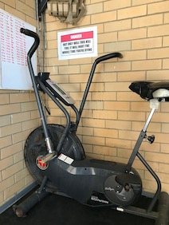

# Year of the Engine Program Review - Year 2

```js
import * as charts from "./charts.js";

// Apply any visual fixes to our charts.
const fixChart = (o) => ({
  backgroundColor: "rgba(0, 0, 0, 0)", // Set background transparent.
  ...o,
});
```

---

Please note this is a review of the **_2nd year_**. [Go here for the 1st
year](../yoe-year1-review/).

---

## tl;dr

I completed the second year of [The Gains Lab](https://thegainslab.com) [Year of
the Engine](https://thegainslab.com/engine) capacity program by [Matt
Wiebke](https://www.instagram.com/thegainslab1/). The results of each workout
were recorded. Some evidence of continued improvement from Year 1 is
demonstrated, although external factors significantly hampered training efforts.
Program difficulty level increased substantially. I continue to recommend the
program if you wish to improve your cardiovascular capacity.

### About this review

This review of Year 2 follows on from [Year 1](../yoe-year1-review/).

<div class="self">
    <p>
    A box like this describes a decision, experience or an observation that I
    made while on the program.
    </p>
</div>

### The virus in the room

I undertook this program during the <a
href="https://en.wikipedia.org/wiki/COVID-19_pandemic">COVID-19 pandemic</a>. I
am located in Australia, and the response from the federal and state governments
has been largely effective at minimising cases and fatalities. To achieve this,
many restrictions were instigated within my home state which introduced many
stressors to day-to-day activities, including training:

- inability to establish a consistent training schedule;
- sacrificing recovery days for training, so as not to fall too far behind
  schedule;
- multiple days of no training due to fulfiling extra familial responsibilities;
- alterations to diet and eating schedule;
- interrupted sleep and an increase in overall stress.

While the results presented here are accurate and complete, I have no idea how
significantly the above issues impacted my training.

<div class="self">
    <p>
    I'm thankful that I was able to complete Year 2 of the program.
    </p>
</div>

### Disclosure

I have trained with The Gains Lab previously, having completed five months of
the [Total Domination](https://www.thegainslab.com/dominate) program about 9
months prior to starting Year of the Engine Year 1. I have also done some
behind-the-scenes work on [The Gains Lab website](https://thegainslab.com)
in exchange for a reduced rate on this program.

This review is unsolicited.

### Approval

Prior to publishing, this review was sent to <a
    href="mailto:coach@thegainslab.com">Matt Wiebke</a> from The Gains Lab seeking:

- Approval to show some specific workouts from the program;
- Comment on accuracy of how I describe the program.

### Workout obfuscation

For purposes of discussion, selected workouts that comprise the program
are described in detail in this review. All other workout descriptions
are obfuscated to protect the content of the program. This obfuscation
is described in more detail <a rel="external" href="#program-workouts">below</a>.

### Data

The results and graphs presented in this review come directly from data
collected throughout the program. Stroke data information for specific rower,
SkiErg and BikeErg workouts were sourced from my account on the [Concept2
Logbook](https://log.concept2.com).

### Program Overview

A broad overview of the program can be found in the [Year 1
review](../yoe-year1-review/). More detail is available on [The Gains
Lab Engine](https://thegainslab.com/engine) page. Matt also gives a good
summary [on this /r/crossfit
thread](https://www.reddit.com/r/crossfit/comments/i86gqh/year_of_the_engine_data_from_a_almost_complete/g19kg1f/).

### Phases

Year 2 has four phases. Each phase builds on the work from the
previous phase, necessitating completing each one before starting the
next.

<table>
    <tr>
        <th>Phase</th>
        <th>Focus</th>
        <th>Months</th>
        <th>Workout&nbsp;types</th>
    </tr>
    <tr>
        <td>Cyborg</td>
        <td>Pure capacity &plus; functional movement</td>
        <td>1, 2, 3</td>
        <td>Ascending, Cyborg, Endurance, Intervals, Polarisation</td>
    </tr>
    <tr>
        <td>Hybrid</td>
        <td>Pacing and power</td>
        <td>4, 5, 6</td>
        <td>Ascending, Cyborg, Endurance, Hybrid, Intervals, Polarisation</td>
    </tr>
    <tr>
        <td>Devour</td>
        <td>Intervals with increasing work-to-rest ratios</td>
        <td>7, 8, 9</td>
        <td>(Ascending) Devour, Endurance, FLUX, Intervals, Polarisation, Time Trial</td>
    </tr>
    <tr>
        <td>Infinity</td>
        <td>Increasing work, Decreasing rest</td>
        <td>10, 11, 12</td>
        <td>Ascending, Endurance, FLUX, Infinity, Intervals, Polarisation, Time Trial</td>
    </tr>
</table>

### Tracks

Year 2 uses a single track; there is no MetCon track like in Year 1.

### Workouts

Workouts were received via email each month as a single .pdf file. Each file
contains four weeks of workouts, each week having five workouts to complete.

### Workout types

Each workout type is described below. As <a rel="external"
href="#about-this-review-workout-obfuscation">mentioned above</a>, only a
select number of workouts are described in full in this document; all other
workout descriptions are obfuscated according to the rules below.

<table>
    <tr>
        <th>Workout Type</th>
        <th>Description</th>
        <th>Example workout</th>
        <th>Obfuscation</th>
        <th>Described here as</th>
    </tr>
    <tr>
        <th>Interval</th>
        <td>Alternating rounds of work time or distance, and rest time.  Broken
        up into speed/threshold, anaerobic and max aerobic power
        sub-types.</td>
        <td>4x500m/1:00r</td>
        <td>Cumulative work time and rest time.</td>
        <td class="right"><strong>2k/3:00r</strong></td>
    </tr>
    <tr>
        <th>Endurance</th>
        <td>Total duration of work time at consistent pace.</td>
        <td>52:00 consistent pace</td>
        <td>No change.</td>
        <td class="right"><strong>52:00</strong></td>
    </tr>
    <tr>
        <th>Cyborg</th>
        <td>Exercises to be done for time, or for rounds and repetitions.</td>
        <td>For time<br />
            <ul>
                <li>20 burpees</li>
                <li>Run 400m (or row 500m)</li>
            </ul>
            Repeat until you have completed 100
            burpees and run 1 mile (or rowed 2k)</td>
        <td>Not used in this review.</td>
        <td>Not used in this review.</td>
    </tr>
    <tr>
        <th>Time trials</th>
        <td>Total duration of work time at or beyond a competition
            pace.</td>
        <td>10:00.0 Time Trial</td>
        <td>No change.</td>
        <td class="right"><strong>10:00.0</strong></td>
    </tr>
    <tr>
        <th>Polarisation</th>
        <td>Total duration of work time, with repeated intervals of
            maximum effort for short durations.</td>
        <td>24:00 at endurance pace with max effort for 0:07 at minutes 5,
            10, 15 and 20</td>
        <td>Total work time.</td>
        <td
            class="right"><strong>24:00</strong></td>
    </tr>
    <tr>
        <th>FLUX</th>
        <td>Alternating rounds of work at endurance pace and above
            endurance pace.</td>
        <td>12 rounds of:
            <ul>
                <li>2 minutes endurance pace</li>
                <li>1 minute at 120% endurance pace</li>
            </ul>
        </td>
        <td>Total work time.</td>
        <td class="right"><strong>36:00</strong></td>
    </tr>
    <tr>
        <th>Ascending</th>
        <td>Max intervals with fixed work / rest times but increasing distance
        / calorie targets.</td>
        <td>??x0:30 work, 0:30 rest<br />
        Row goals: 105m-110m-115m-120m-125m-etc<br />
        Bike goals: 9cal-10cal-11cal-12cal-etc
        </td>
        <td>Distance &plus; delta distance</td>
        <td class="right"><strong>105+15</strong></td>
    </tr>
    <tr>
        <th>Hybrid</th>
        <td>Multiple varied interval sets, separated by rest.</td>
        <td>4 rounds:
            <ul>
                <li>1:00 work</li>
                <li>0:30 rest</li>
            </ul>
            Rest 2:00<br />
            4 rounds:
            <ul>
                <li>2:00 work</li>
                <li>0:30 rest</li>
            </ul>
        </td>
        <td>Cumulative work time and rest time</td>
        <td class="right"><strong>12:00/6:00r</td>
    </tr>
    <tr>
        <th>Devour</th>
        <td>Increasing work time with unchanging rest at a variant of time
        trial pace.</td>
        <td>8 rounds total<br />
        0:30 work, 0:30 rest<br />
        1:00 work, 0:30 rest<br />
        1:30 work, 0:30 rest<br />
        ...<br />
        Continue until you reach 4:00<br />
        Pace = time trial pace -1cal</td>
        <td>Cumulative work time and rest time</td>
        <td class="right"><strong>10:00/8:00r</strong></td>
    </tr>
    <tr>
        <th>Infinity</th>
        <td>Intervals with increasing work time but steady rest, then intervals
        with steady work time but decreasing rest, then a max time round. All
        intervals to be done at a variant of time trial pace.</td>
        <td>@ time trial pace -1cal:<br />
        1:00 work, 1:00 rest<br />
        2:00 work, 1:00 rest<br />
        3:00 work, 1:00 rest<br />
        3:00 work, 0:45 rest<br />
        3:00 work, 0:30 rest<br />
        3:00 work, 0:15 rest<br />
        <br />
        After 0:15 rest, continue until you fail the pace in a given minute<br /></td>
        <td>Cumulative work time and rest time</td>
        <td class="right"><strong>15:00+/4:30r</strong></td>
    </tr>
</table>

[Sample workouts](https://www.thegainslab.com/engine)
[FAQ](https://www.thegainslab.com/yefaq)

### Equipment

Year of the Engine uses ergometers. The program as supplied gives options for:

- Rowing on the Concept2 indoor rowing machine or similar;
- Skiing on the Concept2 SkiErg or similar;
- Biking on the Assault Air Bike, Rogue Echo Bike, Concept2 BikeErg, Schwinn
  AirDyne or similar; and
- Running.

Each workout can be completed with a different apparatus. Alternative apparatus
for the workout are noted.

### Additional Training

The program can be run as standalone or in addition to other training.
Integration with other training is left to the athlete to manage.

## Methodology

### The subject

- Male, even later 40s than in Year 1, 182cm, 100kg.
- Married, kids, desk-bound work. Normal day-to-day western-lifestyle stresses.
  Also see <a rel="external" href="#about-this-review-the-virus-in-the-room">The
  virus in the room</a>.
- Basketball, mountain biking, road cycling, snowboarding, martial arts prior
  to 2012. CrossFit and running about after the kids since 2012.
- Non-competitive exerciser. Training to stay healthy.
- Between 30 and 45 minutes available to train when free time is available.
- Meat-and-three-veg diet. Dad-bod well in progress.

### Scheduling

The program places no restriction on what days workouts are to occur,
only that each weeks' workouts are to be completed before moving to the
next week.

The program deliberately allows you to move workouts around during the
week in order to fit in with other training and life.

<div class="self">
    <p>
    Rest days were also slotted haphazardly, which no doubt affected
    recovery and subsequent workouts.
    </p>
</div>

### Additional Training

No additional training was undertaken during Year 2.

<div class="self">
    <p>
    All other exercise was incidental, mostly just playing with my kids.
    </p>
</div>

### Equipment

I chose:

<table>
    <tr>
        <th>Workout&nbsp;type</th>
        <th>Apparatus</th>
        <th>Rationale</th>
    </tr>
    <tr>
        <td>Ascending<br />
            Cyborg<br />
            Devour<br />
            Hybrid<br />
            Infinity<br />
            Interval
        </td>
        <th>Rower SkiErg BikeErg</th>
        <td>Concept2 provide the mobile application <a
        href="https://concept2.com/ergdata">ErgData</a> which records entire
        workouts performed on their ergometers. This includes per-stroke data,
        which came in useful for examining interval consistency.</td>
    </tr>
    <tr>
        <td>Time trials</td>
        <th>Rower</th>
        <td>I chose only the rower for time trials.</td>
    </tr>
    <tr>
        <td>Endurance<br />
            Polarisation<br />
            FLUX<br />
        </td>
        <th>AirDyne</th>
        <td>I find longer sessions more comfortable and tolerable on
            the bike than on rower or SkiErg.</td>
    </tr>
</table>

| Schwinn AirDyne6                                              | Concept2 SkiErg                                              | Concept2 Rower                                              | Concept2 BikeErg                            |
| ------------------------------------------------------------- | ------------------------------------------------------------ | ----------------------------------------------------------- | ------------------------------------------- |
|  |  |  |  |

### Recording results

The .pdf supplied each month specifies what to record for each workout, with
space available to write results. Matt suggests printing out each sheet and
recording directly on the sheet.

<div class="self">
    <p>
    On the rower, SkiErg and BikeErg I used Concept2's <a
    href="https://concept2.com/ergdata">ErgData</a> to record each session,
    which were then uploaded to the <a href="https://log.concept2.com">Concept2
    Logbook</a>. Workout information, including stroke data, was extracted using
    the <a href="https://log.concept2.com/developers/documentation/">Concept2
    developer API</a>).
    </p>
    <p>
    The AirDyne lacks automated recording, so I took a photo of the
    monitor at the end of each workout and tabled the results in a
    spreadsheet.
    </p>
</div>

### Execution

I started the program on Thursday 17th September 2020, and finished on Thursday
30th September, 2021.

Workouts, and their phases, were completed as below.

```js
echarts
  .init(
    display(html`<div style="max-width: 640px; height: 200px;"></div>`),
    "dark"
  )
  .setOption(fixChart(charts.execution.summary()));
```

## Objective results

The following workouts are presented as evidence of performance changes during
Year 2 of the Year of the Engine program. The results are mine alone (<i>n</i> =
1).

### 10:00.0 Rower time trial

The 10:00.0 time trial is scheduled at the start of phase 3 (week 27) and at the
start of phase 4 (week 41). These tests are not placed outside of the workout
schedule; they are included as part of training. No special preparation was
taken for these tests.

```js
echarts
  .init(
    display(html`<div style="max-width: 640px; height: 200px;"></div>`),
    "dark"
  )
  .setOption(fixChart(charts.timeTrials()));
```

There was a 1% increase in both calories and distance recorded between the two
trials. This small an increase requires further investigation.

Let's compare splits first:

```js
echarts
  .init(
    display(html`<div style="max-width: 640px; height: 250px;"></div>`),
    "dark"
  )
  .setOption(fixChart(charts.compareSplits([52817150, 55235950])));
```

Test 2 showed small, consistent increases in distance at each split over test 1,
with a large increase in the final split. Similarly, the variance in pace between the
tests was consistent, and splits were negative after the 1st in both.

Instantaneous pace per stroke:

```js
echarts
  .init(
    display(html`<div style="max-width: 640px; height: 250px;"></div>`),
    "dark"
  )
  .setOption(
    fixChart(
      charts.compareStrokedata(
        [52817150, 55235950],
        { dataZoom: [{ startValue: 5 }] },
        "p"
      )
    )
  );
```

In test 1, pace was consistent until a sharp increase at 9:30.

In test 2, pace was consistent until a sharp increase at 8:00, then a small
reduction at 8:30, then resumption at higher pace at 9:14.

<div class="self">
    <p>
    The change in pace in test 1 was an "everything is going good; let's sprint the
    last 0:30."
    </p>
    <p>
    The change in pace in test 2 was an over optimistic "sprint the last
    split... nope, started too early, let's back off a bit, try to sprint the
    very last bit."
    </p>
</div>

A more interesting observation is the instantaneous stroke rate:

```js
echarts
  .init(
    display(html`<div style="max-width: 640px; height: 200px;"></div>`),
    "dark"
  )
  .setOption(
    fixChart(
      charts.compareStrokedata(
        [52817150, 55235950],
        {
          dataZoom: [
            {
              startValue: 5,
            },
          ],
        },
        "sr"
      )
    )
  );
```

The stroke rate in test 1 sharply increased during the sprint, however in test
2, while the stroke rate did increase by a point, it was not nearly as high as
in test 1.

We can confirm a tighter grouping of stroke rate in test 2 by counting the
number of strokes at each stroke rate:

```js
echarts
  .init(
    display(html`<div style="max-width: 640px; height: 300px;"></div>`),
    "dark"
  )
  .setOption(fixChart(charts.compareStrokeFrequency([52817150, 55235950])));
```

Test 1 stroke rate varied from 24 to 30, while test 2 stayed between 25 and 27,
straying outside the range for a total of 4 strokes out of 254.

We can say that **a higher level of power was generated at the same stroke rate
during the sprint in test 2**.

<div class="self">
    <p>
    An aside: 2,000m (2km) is a competition distance in the rowing community,
    for both on-the-water and indoor apparatus. I comfortably hit 2km at 7:19.7
    in test 1 and 7:18.7 in test 2. I don't believe the 0:01 difference is
    significant, but it does indicate how closely I paced both tests.
    </p>
</div>

It is difficult to conclude there was a significant improvement in performance
based on these results.

<div class="self">
    <p>
    Both tests felt RPE 7-8 at 2km, RPE 8-9 at the end of the sprints. I think
    an improved pacing strategy across the entire piece, rather than trying to
    sprint the last split, may be more productive.
    </p>
    <p>
    It is interesting that the pace error in test 2 was not only recoverable but
    did not affect the finish.  A coach's interpretation here would be quite
    useful.
    </p>
</div>

### Steady state performance

In Year 1, steady state (Endurance) workouts range from 20:00 to 60:00, while in
Year 2, Endurance is prescribed as 45:00 however the athlete may choose anywhere
from 30:00 to 60:00.

Below are all my steady state workouts, shown as speed (workout distance divided
by workout time) against date. The red shading are workouts from Year 1, the
green shading are workouts from Year 2:

```js
echarts
  .init(
    display(html`<div style="max-width: 640px; height: 200px;"></div>`),
    "dark"
  )
  .setOption(fixChart(charts.steadyState()));
```

<div class="self">
    <p>
    I chose too fast a pace in the first half of Year 1, as these workouts were
    a shorter duration and I reasoned I could get away with it. My results in
    the second half of Year 1 showed I did not have a good base, and paid for it
    with haphazard results, albeit improving at the end of the year.
    </p>
    <p>
    A better result can be seen in Year 2 against a dedicated time of 45:00.
    The pace was slightly slower but far more consistent, with an upward trend
    as the year progressed.
    </p>
</div>

## Program review

<div class="self">
    <p>
    From here on is entirely my opinion. Data is from my results.
    <a href="https://reddit.com/u/angrytongan">Feel free to disagree</a>.
    </p>
</div>

### Program Structure

The structuring of Year 2 is the same as Year 1:

- 5 workouts per week.
- 4 weeks supplied at the start of the month.
- 3 months per phase.
- 4 phases over the entire year.
- Move workouts around to suit your schedule.
- Standalone or integrate with your existing training.
- Ergometer or feet required.
- Workouts are unambiguously described.

### Workout intensity

Like Year 1, the intensity of each workout type is described at the start of
each 3-month phase. The first 2 phases of Year 2 run like Year 1, where the
athlete works at a pace sustainable across the entire workout, or as a
percentage of the athlete's endurance pace that was determined in Year 1. Here,
the athlete's goal in approaching all workouts remains unchanged: [maximise the
average, minimise the range](https://www.thegainslab.com/interval-training).

The latter 2 phases of Year 2 (Devour and Infinity) incorporate new workout
types where pacing for these workouts is given as a variation of a **time-trial
pace**. At the start of month 7 (Devour phase) and month 10 (Infinity phase),
the athlete completes a 10:00 time trial on their chosen apparatus to determine
this pace.

### Pacing off a time trial

At the completion of each time trial, the number of calories accumulated on the
apparatus' monitor is divided by 10 to yield a target **pace per minute** value.
This value is referenced as **TT**, and the required pace in a workout is
specified as a variation of this value. For example, TT-1 means 1 second
_slower_ than TT pace, TT&plus;2 means 2 seconds _faster_ than TT pace).

This value is used in Devour and Infinity workout types. For example,

- 8 rounds total
  - 0:30 work, 0:30 rest
  - 1:00 work, 0:30 rest
  - 1:30 work, 0:30 rest
  - ...
- Continue until you reach 4:00
- Pace = **TT&minus;1**

This workout is 8 rounds long. Each work period per round extends by 0:30, the
rest period does not change, and it is to be performed at the athlete's time
trial pace minus one (1).

Pace varies from TT&minus;4 to TT&plus;4 in Devour and Infinity workouts.

<div class="self">
    <p>
    I found it easier to program TT by converting from <em>calories per
    minute</em> to <em>pace</em> which is useful for machines that do not
    display calories per minute.
    </p>
    <p>
    For Concept2 machines, the conversion can be done using <a
    href="https://www.concept2.com/indoor-rowers/training/calculators/pace-calculator">Concept2's
    calculators</a>, the PM5 itself using the pace option, or by referencing
    this chart:
    </p>
</div>

```js
echarts
  .init(
    display(html`<div style="max-width: 640px; height: 250px;"></div>`),
    "dark"
  )
  .setOption(fixChart(charts.ttConversionChart()));
```

<div class="self">
    <p>
    I found the Devour and Infinity workouts to be very difficult, and
    failed quite a few. I classified the workout as failed if I was unable to
    sustain the prescribed pace in any interval.
    </p>
    <p>
    In the Devour phase, after failing multiple workouts, I chose to drop my TT
    until I reached a pace that allowed me to get to the end of these workouts.
    The downside was workouts specified slower than TT were not challenging.
    </p>
    <p>
    In the Infinity phase, I chose to remain at my calculated TT, instead
    working to failure on any given interval, taking the remaining time as rest,
    then repeating this for the remaining intervals. Workouts that had a
    max-out round at the end were done at least 1 TT point higher than
    prescribed in order to &ldquo;make up&rdquo; for the fails (it made sense in
    my head at the time).
    </p>
</div>

### Time commitment

Similarly to Year 1, workout length in Year 2 varies from medium to long:

```js
echarts
  .init(
    display(html`<div style="max-width: 640px; height: 250px;"></div>`),
    "dark"
  )
  .setOption(fixChart(charts.timeCommitment()));
```

Different workout types vary in length, just like Year 1:

```js
echarts
  .init(
    display(html`<div style="max-width: 640px; height: 250px;"></div>`),
    "dark"
  )
  .setOption(fixChart(charts.timeWorkoutDistribution()));
```

Most workouts in Year 2 are around 30:00, with the exception of Endurance and
Polarisation which can be up to 60:00.

### Varied, not random

Just like Year 1, new workout types are introduced as the program progresses:

```js
echarts
  .init(
    display(html`<div style="max-width: 640px; height: 200px;"></div>`),
    "dark"
  )
  .setOption(fixChart(charts.variationWorkoutByDate()));
```

In Year 1, each phase had at least 3, and at most 4, different workout types. In
Year 2, each phase mixes the new workout types with previously seen ones. This
leads to a greater variety of workouts, although there is still a dominant theme
in each phase:

```js
echarts
  .init(
    display(html`<div style="max-width: 640px; height: 250px;"></div>`),
    "dark"
  )
  .setOption(fixChart(charts.variationWorkoutByPhase()));
```

### Mental fortitude

The Devour and Infinity phases of Year 2 will do more than test your ability to
&ldquo;embrace the suck&rdquo;. Operating at multiple steps above your 10:00
time trial pace, even though at shorter intervals, is very mentally taxing.
Matt advises to back off the intensity of the other workout types a little, as
the TT&plus; workouts very much give your brain a beating.

<div class="self">
    <p>
    I found phase 4 to be a bit disheartening, as it was clear I would not be
    able to successfully complete all rounds of many of the Infinity workouts
    without failing.
    </p>
    <p>
    In comparison, the other interval workout types feel easier, although they
    are still solid work. Endurance and Polarisation workouts feel like a breeze
    against Devour and Infinity workouts.
    </p>
</div>

## Supplementary notes

### Concept2 Performance Monitor Issues

Devour and Infinity phases use interval workouts where the work period changes,
the rest period changes, or some combination of both. On the Concept2 rower,
SkiErg or BikeErg, these can be setup as [Variable Interval
Workouts](https://www.concept2.com/service/monitors/pm5/how-to-use/setting-variable-interval-workout)
using the Performance Monitor (PM5). This makes executing the workout easier, as
once set, the athlete just follows the timing on the PM5. A pace boat / skier /
bike can also be set.

However, about half of the workouts I did that used variable intervals were not
recorded properly by the PM5, due to:

- the PM5 dropping out of the workout to the main menu;
- the PM5 display stopping randomly;
- the PM5 display stopping randomly, but the workout timer continued;
- the PM5 showing an error message, and stopping the workout;
- losing the connection to ErgData, and dropping the workout;
- ErgData crashing;
- or a combination of the above.

Broken workouts appeared the PM5 history either truncated, or as garbage:

<div style="display: flex; justify-content: space-around;">
    
</div>

Ugh.

<div class="self">
    <p>
    Troubleshooting didn't get anywhere. Old batteries, new batteries, with
    ErgData, without ErgData, latest firmware, move the ergs to different
    locations - there was no reliable way to reproduce the behaviour or mitigate
    it's frequency.
    </p>
    <p>
    A simple backup would be to write out the workout and timestamps on a
    whiteboard, and use an external clock just in case the monitor dumps in the
    middle of the workout. It became quite frustrating to try and program the
    remainder of a workout into the device part way through.
    </p>
</div>

### Comparing the BikeErg and AirDyne

A common question on the [CrossFit subreddit](https://reddit.com/r/crossfit)
is how to equate the metrics of the Concept2 BikeErg, the Rogue Echo Bike, the
Assault AirBike, the Schwinn AirDyne and other bike ergometers. Workouts targets
for one type of machine will differ for others, and athletes may not have access
to the device specified in the workout but want to equate their performance.

No manufacturer makes available the exact specifictions for calculating their
metrics on their machines (the [Physics of
Ergometers](http://eodg.atm.ox.ac.uk/user/dudhia/rowing/physics/ergometer.html)
makes a good case for Concept2 devices). Various formulas for converting between
some bikes exist on the Internet, all of which are unverified and supported by
anecdotal evidence only.

[Here are a few
graphs](https://ergarcade.com/articles/airbike-rpm-speed-power.html) that equate
speed, RPM and power between the BikeErg, Schwinn AirDyne6 and the Assault bike.
Note that this **does not equate your effort on the machine**, only the
values displayed on the monitors.

<div class="self">
    <p>
    I was fortunate enough to have access to both a Schwinn AirDyne6 and a
    Concept2 BikeErg during Year 2. Below are my 45:00 steady-state endurance
    workouts, done on either AirDyne6 or BikeErg (drag factor 80 to 82), held at
    my steady state pace of approxmately 30km/h. Note that the BikeErg
    accumulated more calories than the AirDyne at what I perceived to be the
    same effort.
    </p>
</div>

```js
echarts
  .init(
    display(html`<div style="max-width: 640px; height: 150px;"></div>`),
    "dark"
  )
  .setOption(fixChart(charts.bikeergAirdyne()));
```

## Summary

The Year of the Engine continues at full speed in Year 2. New workout types are
introduced, keeping variability high, whilst still remaining true to the core
work introduced in Year 1.

The guides, introduced at the start of each phase, remain clear and easy to
understand.

It should be noted that the difficulty of some workouts increases, particularly
in the second half of the year.

## Recommendations

<div class="self">
    <p>
    I thoroughly enjoyed the challenges presented in Year 2. Even though I had
    difficulty in the latter part of the program, I believe that I am fitter at
    the end of Year 2 compared to the end of Year 1, even with all the
    distractions that life presented.
    </p>
    <p>
    My consistency has improved, in both interval and time trials, and I have
    made some progress with longer steady state workouts.
    </p>
    <p>
    Overall, I am very happy, and I look forward to starting Year 3.
    </p>
</div>

<style>
    .self {
        max-width: 640px;
        border: 1px solid #0af;
        color: #eee;
        background: #06a;
        padding-left: 1em;
        padding-right: 1em;
        margin-bottom: 1em;
    }
    .self a {
        color: white;
    }
</style>
